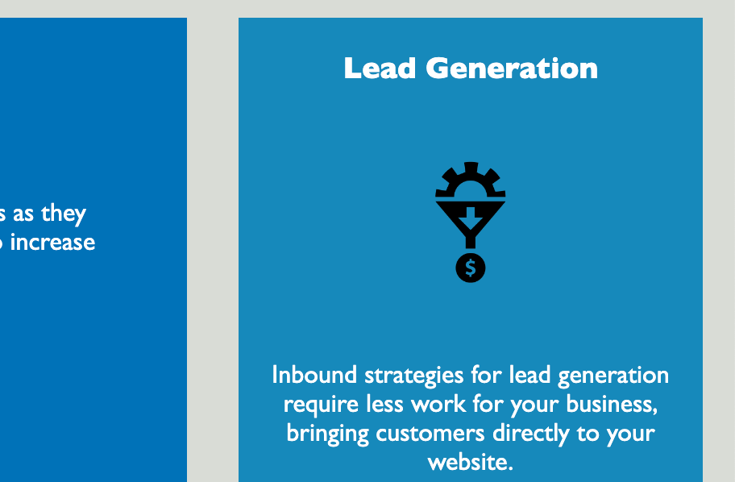

# Horiseon Website Code Refactor

## Description 

The scope of this project was to refactor existing code for the Horiseon website to create a more accessible site, using updated language to improve readability. 

I added alt text to the images, which will allow users with screen readers to access the site in a more inclusive way. I added a descriptive title to optimize the site for search engines. 

I learned how to use semantic html elements and classes to consolidate existing code. I combined duplicate formatting instructions into a single class for each relevant section. This will provide longterm stability to the codebase and make it easier for future developers to read and make further updates. 

## Usage

Users who [visit the Horiseon website](https://ajpupping.github.io/horiseon-website-project/) will find navigation links in the header, allowing quick access to different sections of the page. 

Clicking the links will take you to descriptions of the different services offered by Horiseon. 

The sidebar explains the benefits of utilizing Horiseon's services. 

## Credits 

The starter code was provided by the UCSD coding bootcamp. 

I used [this guide](https://coding-boot-camp.github.io/full-stack/html/html-cheatsheet) to learn more about semantic html elements. 

And [this guide](https://devcracker.medium.com/how-to-add-a-link-or-hyperlink-in-readme-md-file-68752bb6499e) to learn how to add a hyperlink in a Readme file.

## License 

This project was created for educational purposes and does not have a license.